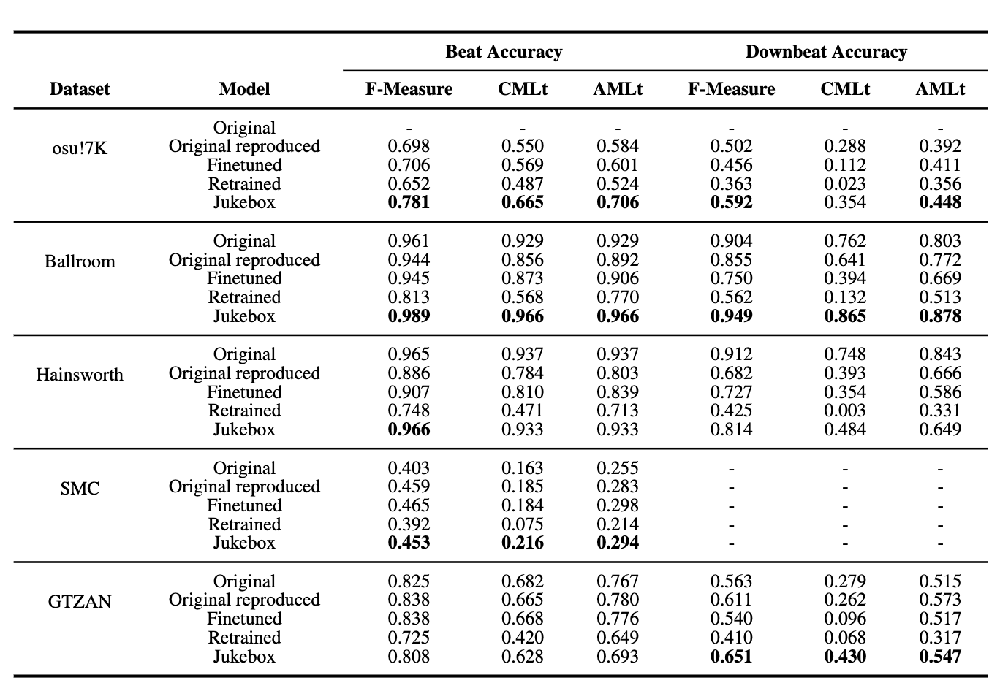

# Setup TCN

Date: March 10, 2024 → March 12, 2024

# Setup Environment on GCP

### (Skip 1, 2 if conda is installed )

1. Instal GPU driver

```jsx
curl https://raw.githubusercontent.com/GoogleCloudPlatform/compute-gpu-installation/main/linux/install_gpu_driver.py --output install_gpu_driver.py
sudo python3 install_gpu_driver.py
```

1. install anaconda

```jsx

*sudo apt-get install libgl1-mesa-glx libegl1-mesa libxrandr2 libxrandr2 libxss1 libxcursor1 libxcomposite1 libasound2 libxi6 libxtst6

curl -O https://repo.anaconda.com/archive/Anaconda3-2024.02-1-Linux-x86_64.sh
bash ./Anaconda3-2024.02-1-Linux-x86_64.sh
#conda install -c anaconda git
git clone https://github.com/tttt1314/Wavebeat_IDLS24.git*
```

1. create an new conda environment using python = 3.8
    
    ```jsx
    conda create --name wavebeat python=3.8
    conda activate wavebeat
    ```
    
2. Pre-install

```
sudo apt-get install libsndfile1 # soundfile issue
sudo apt-get install gfortran libopenblas-dev liblapack-dev
pip install scipy==1.2.1 # error
sudo apt-get install sox
!pip install numpy==1.23.5
```

1. Install torch 

```jsx
python3.8 -m pip install torch==1.7.1+cu110 torchvision==0.8.2+cu110 torchaudio==0.7.2 -f [https://download.pytorch.org/whl/torch_stable.html](https://download.pytorch.org/whl/torch_stable.html)
```

1. Install these packages first

```jsx
pip install numpy cython aiohttp
```

1. Install requirement_new.txt

```jsx
pip install -r requirement_new.txt
```

1. pytorch_lightning

```jsx
pip install pytorch_lightning==1.8.6
pip install protobuf==3.20.0
```

1. torchaudio=0.13.0 read mp3

```jsx
conda install 'ffmpeg<5'
```

# Dataset Downloads

## Audio

### Hainsworth

```jsx
gdown [1ctMDHAoeTBG5LSbtQIQBIv4vTI0oB0u1&export=download&authuser=0](https://drive.usercontent.google.com/download?id=1ctMDHAoeTBG5LSbtQIQBIv4vTI0oB0u1&export=download&authuser=0)
tar zxvf Hainsworth.tgz
```

### Ballroom

```jsx
wget https://mtg.upf.edu/ismir2004/contest/tempoContest/data1.tar.gz
```

### SMC

Note: In SMC, there’s no specific downbeat notation. Thus, set every beat as down beat.

```python
gdown 1Bacby2o2VRoj9QRAgZV6cl5v5MeUy5n2
```

### GTZAN

```jsx
gdown 1W0zYEs5iX2F0_NmGfcpsaT_cE3OPC5Ni
```

## Annotations

```jsx
git clone https://github.com/superbock/ISMIR2019.git
```

# Reproduce

 1. open juputer notebook

```jsx
jupyter notebook --no-browser -port=8888
```

1. Open Reproduce.ipynb
    1. Run Testing Cell

# TCN validation test

# Jukebox feature extraction
1. audio = jukemirlib.load_audio(audio_file)
   Basically, this function includes (a) resampling to 44.1k hz (b) normalize the signal
3. feat = jukemirlib.extract(audio, layers=[36])
   1. first select the first 25 sec (or 24 sec) of the audio (see get_z() in jukemirlib.lib) as an input to the Jukebox VQ-VAE model
   2. Take the last level(downsampling factor of 128) of the VQ-VAE output as codified audio. Trim it to length of 8192.
   3. Input the codified audio into jukebox language model. Take the 36th layer output as our extracted feature.
   
### Note: the extracted feature should be 8192*4800
   

## Problems

1. Not complete match of annotation and audiofiles
2. gtzan_jazz_00003 don’t have beat notation, only time sec
3. jazz.00054.wav in GTZAN is corrupted

## Solutions

1. only use the file which is annotated
2. set all beats to 1  
3. skip that file

# Future works
1. pooling the juke features in layer domain cause currently it takes about 2 TB
2. 

# Results



